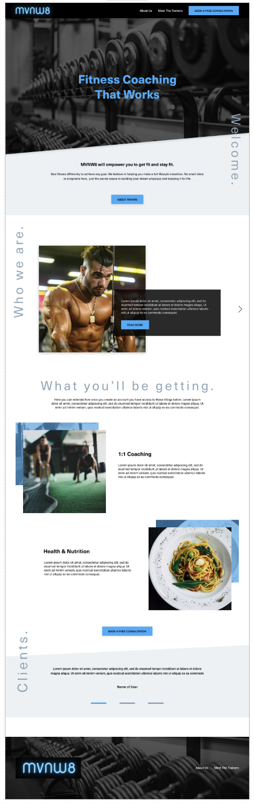
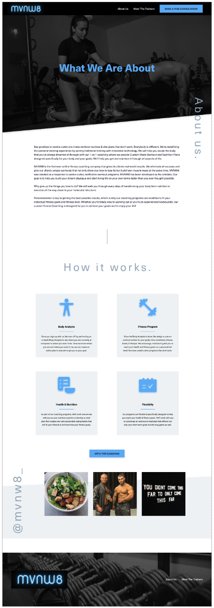
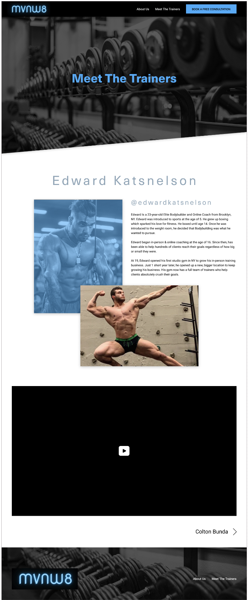

# mvnw8

A fitness website that will empower clients to get fit and stay fit. Building lifetyles through nutrition and workouts. Potential clients are able to book consultations before making any commitment.

Partnered with UX/UI designer Shirley Joseph for high fidelity design screens.

## Technologies Used

* HTML5
* CSS3
* JavaScript
* [Icons](https://fontawesome.com/icons?d=gallery&p=2)
* [Figma](https://www.figma.com/files/user/979381893432674988?fuid=979381893432674988)
* [Pinterest](https://www.pinterest.com/)
* [Unsplash](https://unsplash.com/)
* [Google Fonts](https://fonts.google.com/)
* [Zeplin](https://zeplin.io/)

## User Stories
* As a user, I want to be able to book a consultation with one of the trainers
* As a user, I want to be able to see what the trainers are offering
* As a user, I want to be able to read testamonials from past and present clients

## Screenshots from Zeplin
### Home Page

### About Page

### Trainer Page

## Getting Started

* [Click here](https://mvnw8.netlify.app/) to see the deployed app using netlify!

## Future Enhancements
The clients backed away from the project due to a change of direction for the business but if the project went on I would like to improve on:
* adding testimonials
* adding an instagram carousel of recent posts
* high fidelity images and videos
* adding individual pages for a get to know of each trainer
